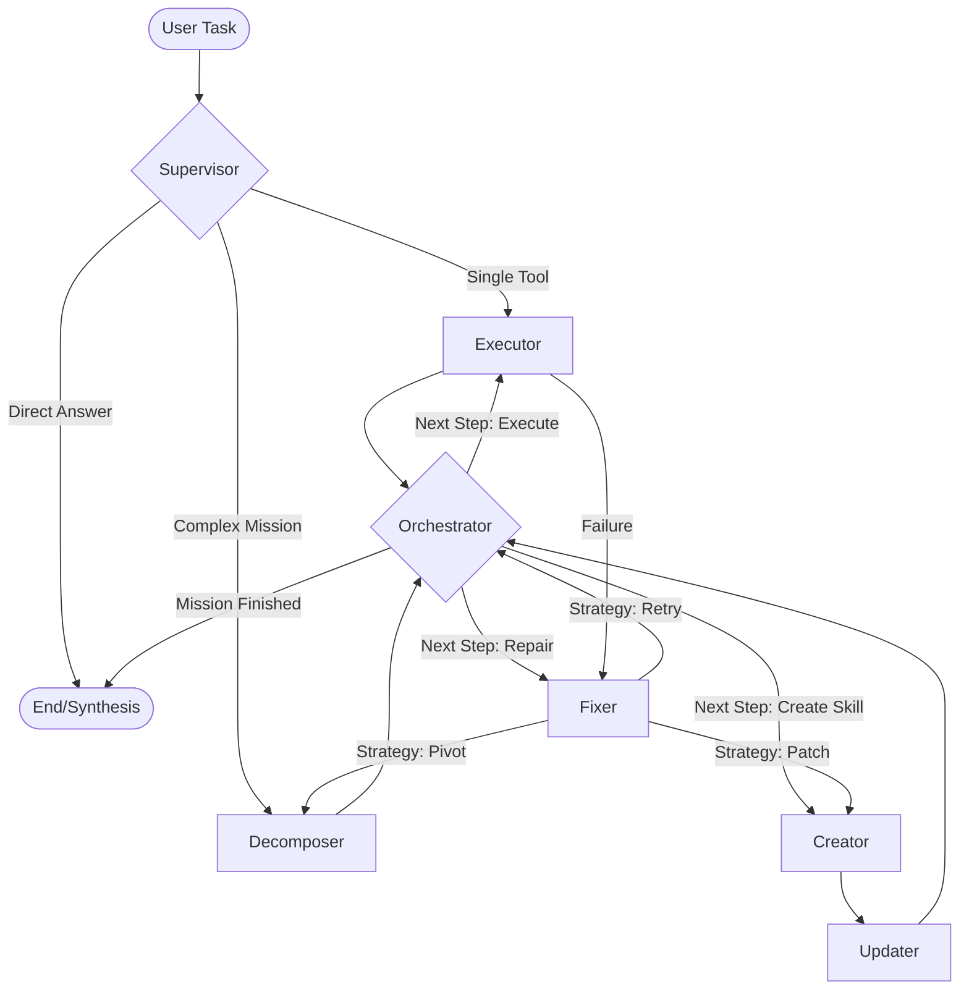

# Self-Evolving Agents: Technical Documentation

This document provides a deep dive into the architecture, internal mechanisms, and self-evolution principles of the **Self-Evolving Agents** framework.

---

## 1. 🏗 System Architecture

The system is built on **LangGraph**, a framework for building stateful, multi-agent applications with cycles. Unlike linear chains, this architecture allows the agent to revisit nodes (like the `Creator` or `Repair` nodes) based on runtime feedback.

### 🔄 The Orchestration Loop

The core execution flow is managed by a Directed Acyclic Graph (DAG) approach within the LangGraph state.



### Key Nodes Explained:

1.  **Supervisor (`supervisor_node`)**: The initial entry point. It uses an LLM to classify the user's intent:
    *   `reply`: Direct answer or chat.
    *   `execute_single`: A single known tool can solve the task.
    *   `complex_mission`: Requires decomposition into multiple steps.
2.  **Decomposer (`router_node`)**: For complex missions, it generates an `OrchestrationDAG` containing nodes, dependencies, and "State Gates" (validation logic).
3.  **Orchestrator (`orchestrator_node`)**: The "Brain" of the DAG execution. It tracks completed nodes and identifies which node can run next based on dependency satisfaction.
4.  **Executor (`executor_node`)**: Handles the actual invocation of Python tools (local or remote MCP). It validates results against the node's `state_gate`.
5.  **Creator (`creator_node`)**: Triggered when a required skill doesn't exist. It generates Python code and a corresponding JSON Schema.
6.  **Updater (`updater_node`)**: Persists the generated code to `skills/generated/` and performs **Hot-Reloading** to inject the new module into the running process.
7.  **Fixer (`fixer_node`)**: Analyzes execution failures. It can decide to retry, patch existing code ("Retrain"), or trigger a "Strategic Pivot" (re-decomposing the mission).

---

## 2. 🧠 State Management

The `AgentState` is the single source of truth passed between nodes.

### `AgentState` Schema (Simplified):
*   `user_task`: The original goal.
*   `dag`: The planned execution graph.
*   `completed_nodes`: A list of IDs of successfully finished tasks.
*   `failed_nodes`: A list of IDs of tasks that crashed or failed validation.
*   `node_outputs`: A dictionary mapping node IDs to their return values.
*   `skill_gen_data`: Temporary buffer for code generation (Code, Schema, Filename).
*   `retry_count`: Tracks attempts for error recovery.

---

## 3. 🛠 Skill System & Hot-Reloading

### Registry (`skills/registry.json`)
Every tool available to the agent is registered here. The registry includes:
*   `name`: The function name.
*   `description`: Used by the LLM for tool selection.
*   `file_name`: Path to the implementation.
*   `parameters`: JSON Schema for input validation.

### Hot-Reloading Mechanism
When a new skill is created, the system uses `importlib.util` to load the file as a module at runtime:
```python
spec = importlib.util.spec_from_file_location(module_name, file_path)
module = importlib.util.module_from_spec(spec)
sys.modules[module_name] = module
spec.loader.exec_module(module)
```
This allows the agent to use functions that were **written by itself** just seconds prior.

---

## 4. 🛡 Self-Evolution & Repair

The framework is "Self-Evolving" because it handles its own limitations:

1.  **Skill Gap Recognition**: If the Supervisor or Decomposer realizes no skill fits the task, it routes to `Creator`.
2.  **Automated Patching**: If a generated tool has a bug, the `Fixer` node reads the traceback, routes back to `Creator` with the error context, and generates a "Patch" (Retrain strategy).
3.  **Strategic Pivot**: If a mission reaches a deadlock or max retries, the system re-evaluates the entire strategy based on current failures and re-plans the DAG.

---

## 5. 🌐 External Integrations

### Model Context Protocol (MCP)
The system can connect to external MCP servers to discover and execute remote tools. These are namespaced with `mcp__` in the registry and executed via `MCPClient`.

### Security & Sudo
The `SecretManager` handles sudo password storage for privileged shell operations. The `Fixer` node can detect `Permission Denied` errors and proactively request credentials from the user.

---

## 6. 🚀 Getting Started with Development

### Adding a Built-in Skill
1.  Add your Python function to `skills/basics.py`.
2.  Add the metadata to `skills/registry.json`.

### Modifying Prompts
Prompts for routing, creation, and repair are located in `agents/prompts.py`. Adjusting these changes the "Cognitive" behavior of the nodes.

---
*Documentation Version: 1.0.0*
