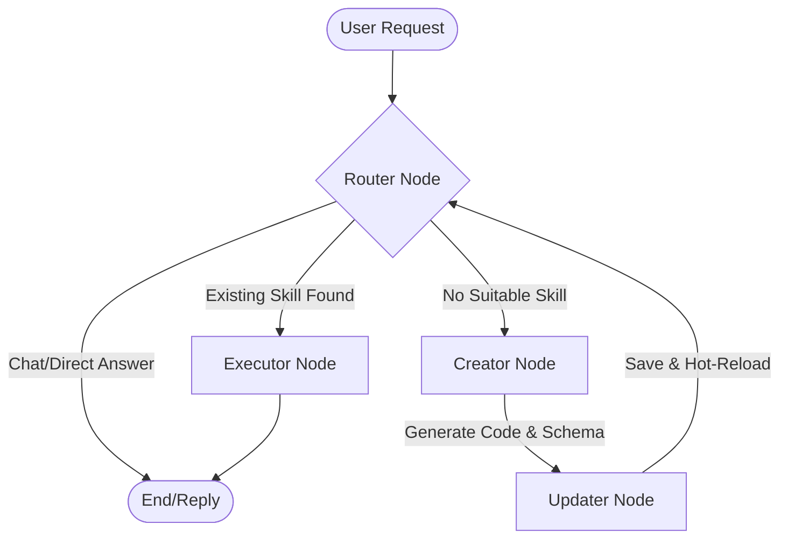

# Self-Evolving Agents

A modular, self-evolving agent framework built with LangGraph. This system is designed to recognize its own functional gaps and "evolve" by generating and loading new Python tools on the fly.

## 🚀 Key Features

- **Self-Evolution Loop**: Automatically generates new tools when existing skills are insufficient.
- **Modern Web Interface**: A sleek, dark-mode chat UI with glassmorphism and real-time feedback.
- **Dynamic Hot-Reloading**: New tools are injected into the running process without requiring a restart.
- **Multi-Provider Support**: Compatible with Google Gemini, OpenAI, and DeepSeek.
- **Strict Schema Enforcement**: Uses Pydantic and JSON Schema to ensure generated tools are compatible with the routing system.

> [!TIP]
> For a deep dive into the system's architecture, hot-reloading, and self-evolution mechanics, see the [Detailed Documentation](file:///home/j-harvey/Desktop/ankur/Projects/self-evolving-agents/DOCUMENTATION.md).

## 🏗 Architecture

The system follows a cyclic graph architecture implemented via **LangGraph**:



### Core Components

1.  **Router**: Analyzes user intent and matches it against the `registry.json`.
2.  **Creator**: The "Brain" that writes Python code and generates OpenAI-compatible function schemas.
3.  **Updater**: The "Hand" that persists code to the filesystem and performs dynamic module loading (Hot-Reload).
4.  **Executor**: Runs the confirmed tools to provide the final result.
5.  **FastAPI Server**: Serves the web interface and handles API requests.

## 📁 Project Structure

```text
.
├── agents/             # System prompts for different nodes
├── core/               # Framework logic (State, Engine, Logic Nodes)
├── frontend/           # Web interface assets (HTML, CSS, JS)
├── runtime/            # Sandbox and execution environments
├── skills/             # Skills management
│   ├── generated/      # Directory where the LLM saves new tools
│   ├── manager.py      # Logic for registering and listing skills
│   └── registry.json   # Metadata for all available skills
├── config.yaml         # Active configuration (ignored by git)
├── config.example.yaml # Configuration template
├── main.py             # CLI entry point
└── server.py           # Web API entry point
```

## 🛠 Getting Started

### 1. Installation

```bash
pip install -r requirements.txt
```

### 2. Configuration

Copy the template and add your API keys:

```bash
cp config.example.yaml config.yaml
```

Edit `config.yaml`:
```yaml
model:
  provider: "deepseek" # or "google", "openai"
  name: "deepseek-chat"
  api_key: "your-api-key"
```

### 3. Running the System

#### Option A: Web Interface (Recommended)
```bash
python server.py
```
Then open `http://localhost:8000` in your browser.

#### Option B: Command Line
```bash
python main.py
```

## 🧠 Implementation Principles

### Dynamic Hot-Reloading
The `Updater` node uses `importlib.util` to load newly created files as modules. This allows the system to execute code that didn't exist when the script started.

### Self-Reflective Loop
If a generated tool fails to load or has syntax errors, the system is designed to catch the exception and route back to the `Creator` for a fix (loop closure).

## 📄 License

This project is licensed under the MIT License - see the [LICENSE](file:///home/j-harvey/Desktop/ankur/Projects/self-evolving-agents/LICENSE) file for details.

---
*Created with ❤️ for Advanced Agentic Coding.*
